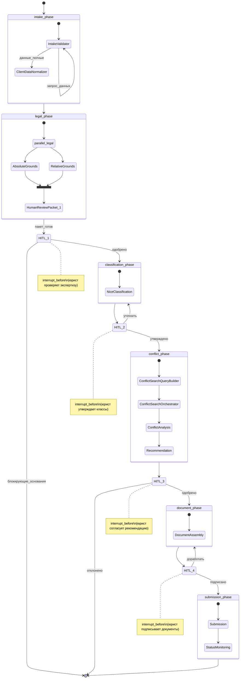

# Архитектура агентов и граф LangGraph

> Архивная целевая спецификация. Она не гарантирует соответствие текущему коду;
> фактический AI-контур описан в `docs/current-state.md` и
> `docs/rag-and-legal-safety.md`.

> **Статус на 15.08.2026:** целевая спецификация. Реализованный backend использует
> сервисы и агентные компоненты, но не весь описанный здесь граф из 13 узлов и
> не все автоматические side effects. Фактический срез — в
> [`current-state.md`](../../current-state.md).

> **Версия:** 1.0  
> **Дата:** 2026-03-29

---

## 1. Обзор агентной подсистемы

Система использует **LangGraph** для оркестрации 13 специализированных агентов. Каждый агент — это отдельный узел (Node) в направленном графе состояний. Граф обеспечивает:

- **Детерминированный поток выполнения** с явными переходами между узлами.
- **Человек в контуре (HITL)** через `interrupt_before` на 4 узлах.
- **Восстановление после сбоев** через механизм чекпоинтов LangGraph.
- **Полную трассировку** каждого выполнения через `AgentRun`.

---

## 2. Обзорная диаграмма агентного графа

```mermaid
flowchart TD
    START([Начало\nОбработки])

    %% === ФАЗА 1: ПРИЁМ ЗАЯВКИ ===
    IV[IntakeValidator\nВалидация первичных данных]
    CDN[ClientDataNormalizer\nНормализация данных клиента]
    
    %% === HITL CHECKPOINT 1: ПРАВОВАЯ ЭКСПЕРТИЗА ===
    AG[AbsoluteGrounds\nАбсолютные основания отказа]
    RG[RelativeGrounds\nОтносительные основания отказа]
    HR1{{"⏸ HITL #1\nЮрист проверяет\nрезультаты экспертизы"}}
    
    %% === HITL CHECKPOINT 2: КЛАССЫ МКТУ ===
    NC[NiceClassification\nКлассификация по МКТУ]
    HR2{{"⏸ HITL #2\nЮрист утверждает\nклассы МКТУ"}}
    
    %% === ФАЗА 3: ПОИСК КОНФЛИКТОВ ===
    CSQB[ConflictSearchQueryBuilder\nФормирование поисковых запросов]
    CSO[ConflictSearchOrchestrator\nОркестрация поиска в ФИПС]
    CA[ConflictAnalysis\nАнализ конфликтующих ТЗ]
    
    %% === HITL CHECKPOINT 3: РЕКОМЕНДАЦИЯ ===
    REC[Recommendation\nФормирование рекомендации]
    HR3{{"⏸ HITL #3\nЮрист согласует\nрекомендацию"}}
    
    %% === ФАЗА 4: ДОКУМЕНТЫ ===
    DA[DocumentAssembly\nСборка пакета документов]
    HR4{{"⏸ HITL #4\nЮрист подписывает\nпакет документов"}}
    
    %% === ФАЗА 5: ПОДАЧА И МОНИТОРИНГ ===
    SUB[Submission\nПодача в ФИПС]
    SM[StatusMonitoring\nМониторинг статуса]
    
    %% === ПАКЕТ ДЛЯ ЮРИСТА ===
    HRP[HumanReviewPacket\nФормирование пакета\nдля юриста]
    
    END([Завершение])
    ABORT([Отклонение/\nАрхивирование])

    %% Основной поток
    START --> IV
    IV -->|"Данные полные"| CDN
    IV -->|"Данные неполные"| REQUEST_INFO[Запрос\nдополнительных\nданных]
    REQUEST_INFO --> IV

    CDN --> AG
    CDN --> RG
    AG --> HRP
    RG --> HRP
    HRP --> HR1
    
    HR1 -->|"Одобрено"| NC
    HR1 -->|"Блокирующие\nоснования"| ABORT
    
    NC --> HR2
    HR2 -->|"Утверждено"| CSQB
    HR2 -->|"Требует\nуточнения"| NC
    
    CSQB --> CSO
    CSO --> CA
    CA --> REC
    
    REC --> HR3
    HR3 -->|"Одобрено"| DA
    HR3 -->|"Отклонено"| ABORT
    
    DA --> HR4
    HR4 -->|"Подписано"| SUB
    HR4 -->|"На доработку"| DA
    
    SUB --> SM
    SM -->|"Завершено"| END
    SM -->|"Office Action"| REQUEST_INFO2[Уведомление\nклиента]
    REQUEST_INFO2 --> SM

    %% Стили
    classDef hitl fill:#ff9999,stroke:#cc0000,stroke-width:2px,color:#000
    classDef agent fill:#99ccff,stroke:#0066cc,stroke-width:1px,color:#000
    classDef terminal fill:#99ff99,stroke:#006600,stroke-width:2px,color:#000
    classDef abort fill:#ffcc99,stroke:#cc6600,stroke-width:2px,color:#000

    class HR1,HR2,HR3,HR4 hitl
    class IV,CDN,AG,RG,NC,CSQB,CSO,CA,REC,DA,SUB,SM,HRP agent
    class END terminal
    class ABORT abort
```



---

## 3. Детальное описание агентов

### 3.1 IntakeValidator (Валидатор первичных данных)

**Назначение:** Проверяет полноту и корректность данных, поданных клиентом. Определяет, можно ли начать обработку или нужны дополнительные сведения.

**Входная схема:**
```python
class IntakeValidatorInput(BaseModel):
    application_id: UUID
    client_data: dict          # Данные клиента из формы
    mark_data: dict            # Данные об обозначении
    goods_services: list[str]  # Предварительный перечень товаров/услуг
    requested_classes: list[int] | None  # Запрошенные классы МКТУ (опц.)
```

**Выходная схема:**
```python
class IntakeValidatorOutput(BaseModel):
    is_complete: bool
    completeness_score: float  # 0.0–1.0
    missing_fields: list[MissingField]
    validation_warnings: list[ValidationWarning]
    can_proceed: bool
    rejection_reasons: list[str]  # Если can_proceed=False
    
class MissingField(BaseModel):
    field_path: str
    description_ru: str
    is_blocking: bool
```

**Используемые инструменты:** Pydantic-валидация (без LLM). Детерминированные правила.  
**Следующий узел:** `ClientDataNormalizer` (если полные) или `__interrupt__` + запрос клиенту.

---

### 3.2 ClientDataNormalizer (Нормализатор данных клиента)

**Назначение:** Приводит данные клиента к каноническому виду: нормализация ИНН, адресов, наименований юрлиц. Обогащает данными из ФНС (если интеграция доступна).

**Входная схема:**
```python
class ClientDataNormalizerInput(BaseModel):
    application_id: UUID
    raw_client_data: dict
    raw_mark_data: dict
```

**Выходная схема:**
```python
class ClientDataNormalizerOutput(BaseModel):
    normalized_client: NormalizedClientData
    normalized_mark: NormalizedMarkData
    enrichment_applied: bool
    enrichment_sources: list[str]
    normalization_notes: list[str]

class NormalizedClientData(BaseModel):
    inn: str               # Валидированный ИНН
    full_legal_name: str   # Полное наименование по ЕГРЮЛ
    ogrn: str | None
    legal_address: str     # Нормализованный адрес
    postal_address: str | None
```

**Используемые инструменты:** ФНС API (опц., через интеграцию), правила нормализации.  
**Следующие узлы:** `AbsoluteGrounds` и `RelativeGrounds` (параллельно).

---

### 3.3 AbsoluteGrounds (Абсолютные основания)

**Назначение:** Проверяет обозначение на абсолютные основания отказа согласно ст. 1483 ГК РФ, пп. 1–8: описательность, обманность, противоречие публичному порядку, государственная символика и т.д.

**Входная схема:**
```python
class AbsoluteGroundsInput(BaseModel):
    application_id: UUID
    mark: TrademarkMarkData
    applicant_info: ApplicantInfo
    rag_context_limit: int = 10  # Максимум чанков для RAG
```

**Выходная схема:**
```python
class AbsoluteGroundsOutput(BaseModel):
    findings: list[LegalFindingSchema]
    overall_risk: RiskLevel  # low|medium|high|blocking
    summary_ru: str
    rag_citations: list[RAGCitation]
    confidence: float

class LegalFindingSchema(BaseModel):
    ground_code: str          # Напр.: "ABS_1483_1_1" 
    article_reference: str    # «ст. 1483, п. 1, пп. 1 ГК РФ»
    severity: Severity
    description_ru: str
    recommendation_ru: str
    confidence: float
```

**Промпт:** `absolute_grounds_check` (из реестра промптов).  
**RAG-запрос:** по типу: `absolute_grounds`, класс марки.  
**LLM:** требует structured output (JSON mode).

---

### 3.4 RelativeGrounds (Относительные основания)

**Назначение:** Проверяет относительные основания отказа (ст. 1483, п. 6–8 ГК РФ): сходство с ранее зарегистрированными ТЗ, фирменными наименованиями, НМПТ.

**Входная схема:**
```python
class RelativeGroundsInput(BaseModel):
    application_id: UUID
    mark: TrademarkMarkData
    requested_classes: list[int]
    rag_context_limit: int = 8
```

**Выходная схема:** Аналогична `AbsoluteGroundsOutput`, с дополнительным полем:
```python
    prior_rights_analysis: list[PriorRightIssue]
    
class PriorRightIssue(BaseModel):
    right_type: str  # «ТЗ», «фирменное наименование», «НМПТ»
    description_ru: str
    risk_level: RiskLevel
```

**Промпт:** `relative_grounds_check`.

---

### 3.5 NiceClassification (Классификатор МКТУ)

**Назначение:** Предлагает оптимальный перечень классов МКТУ и товаров/услуг для регистрируемого обозначения с обоснованием.

**Входная схема:**
```python
class NiceClassificationInput(BaseModel):
    application_id: UUID
    mark: TrademarkMarkData
    preliminary_goods_services: list[str]  # Список от клиента
    business_description: str | None       # Описание бизнеса
    existing_classes: list[int] | None     # Уже выбранные классы
```

**Выходная схема:**
```python
class NiceClassificationOutput(BaseModel):
    suggestions: list[ClassSuggestion]
    total_classes_suggested: int
    reasoning_summary_ru: str
    
class ClassSuggestion(BaseModel):
    nice_class: int
    items: list[GoodsServicesItemSchema]
    reasoning_ru: str
    confidence: float
    is_primary: bool  # Основной класс для данного бизнеса
```

**Промпт:** `nice_classification`.  
**RAG-запрос:** по типу `classification`, с метаданными по классу.

---

### 3.6 ConflictSearchQueryBuilder (Строитель поисковых запросов)

**Назначение:** Формирует набор поисковых запросов для ФИПС, учитывая фонетические, визуальные и семантические варианты сходства.

**Входная схема:**
```python
class ConflictSearchQueryBuilderInput(BaseModel):
    application_id: UUID
    mark: TrademarkMarkData
    approved_classes: list[int]
    search_strategy: SearchStrategy = SearchStrategy.COMPREHENSIVE
```

**Выходная схема:**
```python
class ConflictSearchQueryBuilderOutput(BaseModel):
    queries: list[SearchQuery]
    estimated_results_count: int | None
    
class SearchQuery(BaseModel):
    query_type: str     # «phonetic», «semantic», «visual», «combined»
    query_text: str
    classes: list[int]
    similarity_threshold: float
    priority: int
```

**Промпт:** `conflict_search_query_builder`.  
**Инструменты:** Генерация фонетических вариантов (транслитерация, Soundex для русского).

---

### 3.7 ConflictSearchOrchestrator (Оркестратор поиска конфликтов)

**Назначение:** Выполняет поисковые запросы против базы ФИПС. Управляет параллельным выполнением и агрегацией результатов.

**Входная схема:**
```python
class ConflictSearchOrchestratorInput(BaseModel):
    application_id: UUID
    job_id: UUID
    queries: list[SearchQuery]
    fips_provider: FIPSProviderConfig
```

**Выходная схема:**
```python
class ConflictSearchOrchestratorOutput(BaseModel):
    job_id: UUID
    results: list[RawFIPSResult]
    total_found: int
    queries_executed: int
    fips_request_ids: list[str]
    execution_time_seconds: float
```

**Инструменты:** `FIPSSearchTool` (mock или реальный адаптер).  
**Особенности:** Дедупликация результатов по `fips_trademark_number`. Retry при сбоях ФИПС API.

---

### 3.8 ConflictAnalysis (Анализ конфликтов)

**Назначение:** Анализирует каждый найденный конфликтующий ТЗ, оценивает степень сходства и риск отказа в регистрации.

**Входная схема:**
```python
class ConflictAnalysisInput(BaseModel):
    application_id: UUID
    mark: TrademarkMarkData
    approved_classes: list[int]
    raw_results: list[RawFIPSResult]
    analysis_depth: AnalysisDepth = AnalysisDepth.STANDARD
```

**Выходная схема:**
```python
class ConflictAnalysisOutput(BaseModel):
    analyzed_results: list[AnalyzedConflict]
    blocking_conflicts_count: int
    high_risk_count: int
    overall_conflict_risk: RiskLevel
    
class AnalyzedConflict(BaseModel):
    fips_trademark_number: str
    similarity_types: list[SimilarityType]
    similarity_score: float
    risk_level: RiskLevel
    analysis_ru: str
    rag_citations: list[RAGCitation]
```

**Промпт:** `conflict_analysis`.  
**RAG-запрос:** по типу `conflict_analysis` с метаданными по классам.

---

### 3.9 Recommendation (Рекомендация)

**Назначение:** Синтезирует результаты всех предыдущих агентов в единую рекомендательную записку для юриста и клиента.

**Входная схема:**
```python
class RecommendationInput(BaseModel):
    application_id: UUID
    legal_review: LegalReviewSummary
    conflict_analysis: ConflictAnalysisSummary
    mark: TrademarkMarkData
    client_info: ClientInfo
```

**Выходная схема:**
```python
class RecommendationOutput(BaseModel):
    recommendation: RecommendationType  # proceed|proceed_with_modifications|...
    executive_summary_ru: str           # Для клиента (нетехнический язык)
    legal_analysis_ru: str              # Для юриста (технический)
    risk_assessment_ru: str
    proposed_actions: list[ProposedAction]
    overall_confidence: float
    rag_citations: list[RAGCitation]
```

**Промпт:** `recommendation_synthesis`.  
**HITL:** `interrupt_before` перед переходом к `DocumentAssembly`.

---

### 3.10 DocumentAssembly (Сборка документов)

**Назначение:** Собирает полный пакет документов для подачи в ФИПС: заявление, доверенность (если нужна), перечень товаров/услуг.

**Входная схема:**
```python
class DocumentAssemblyInput(BaseModel):
    application_id: UUID
    approved_mark: TrademarkMarkData
    approved_classes: list[ApprovedClass]
    client_data: ClientData
    representative_data: RepresentativeData | None
    recommendation: RecommendationData
```

**Выходная схема:**
```python
class DocumentAssemblyOutput(BaseModel):
    package_id: UUID
    documents: list[GeneratedDocument]
    completeness_check: CompletenessCheck
    missing_required_docs: list[str]
    is_ready_for_submission: bool
    
class GeneratedDocument(BaseModel):
    template_code: str
    file_path: str
    file_name: str
    version: str
    checksum: str
```

**Инструменты:** `DocxGeneratorTool`, `DocumentTemplateRepository`.  
**Промпт:** `document_field_extraction` (для извлечения значений полей из данных заявки).

---

### 3.11 Submission (Подача в ФИПС)

**Назначение:** Отправляет утверждённый пакет документов в ФИПС и фиксирует квитанцию.

**Входная схема:**
```python
class SubmissionInput(BaseModel):
    application_id: UUID
    package_id: UUID
    submission_channel: SubmissionChannel
    fips_credentials: FIPSCredentials  # Из secrets
```

**Выходная схема:**
```python
class SubmissionOutput(BaseModel):
    submission_id: UUID
    fips_receipt_number: str | None
    fips_request_id: str | None
    status: SubmissionStatus
    submitted_at: datetime
    error_message: str | None
```

**Инструменты:** `FIPSSubmissionTool`.  
**Особенности:** Идемпотентность — повторная отправка того же пакета не создаёт дубликаты.

---

### 3.12 StatusMonitoring (Мониторинг статуса)

**Назначение:** Периодически опрашивает ФИПС на предмет изменений статуса заявки. Обрабатывает входящие уведомления и OA (office actions).

**Режим работы:** Фоновое задание (APScheduler), запускается по расписанию (каждые 6 часов).

**Входная схема:**
```python
class StatusMonitoringInput(BaseModel):
    submission_id: UUID
    fips_request_id: str
    last_known_status: str
    last_checked_at: datetime | None
```

**Выходная схема:**
```python
class StatusMonitoringOutput(BaseModel):
    status_changed: bool
    new_status: str | None
    events: list[StatusEventData]
    next_check_at: datetime
    requires_action: bool
    action_description_ru: str | None
    action_deadline: date | None
```

**Инструменты:** `FIPSStatusCheckTool`.

---

### 3.13 HumanReviewPacket (Пакет для юриста)

**Назначение:** Агрегирует выходы предыдущих агентов в единый структурированный пакет для рассмотрения юристом. Формирует UI-данные для панели проверки.

**Входная схема:**
```python
class HumanReviewPacketInput(BaseModel):
    application_id: UUID
    absolute_grounds_output: AbsoluteGroundsOutput
    relative_grounds_output: RelativeGroundsOutput
    checkpoint_type: HITLCheckpoint  # 1..4
```

**Выходная схема:**
```python
class HumanReviewPacketOutput(BaseModel):
    packet_id: UUID
    checkpoint_type: HITLCheckpoint
    summary_for_lawyer_ru: str
    action_items: list[ActionItem]
    raw_agent_outputs: dict
    severity_overview: SeverityOverview
    
class ActionItem(BaseModel):
    action_type: str
    description_ru: str
    is_required: bool
    ui_component: str  # Компонент UI для отображения
```

---

## 4. Полный граф состояний LangGraph



---

## 5. Конфигурация LangGraph

### 5.1 Определение графа

```python
# backend/app/agents/graph.py
# Граф оркестрации агентов регистрации товарного знака

from langgraph.graph import StateGraph, END
from langgraph.checkpoint.postgres import PostgresSaver
from app.agents.state import ApplicationGraphState

def build_trademark_graph() -> StateGraph:
    """Построение полного графа обработки заявки на ТЗ."""
    
    graph = StateGraph(ApplicationGraphState)
    
    # Регистрация узлов
    graph.add_node("intake_validator", intake_validator_node)
    graph.add_node("client_data_normalizer", client_data_normalizer_node)
    graph.add_node("absolute_grounds", absolute_grounds_node)
    graph.add_node("relative_grounds", relative_grounds_node)
    graph.add_node("human_review_packet", human_review_packet_node)
    graph.add_node("nice_classification", nice_classification_node)
    graph.add_node("conflict_search_query_builder", csqb_node)
    graph.add_node("conflict_search_orchestrator", cso_node)
    graph.add_node("conflict_analysis", conflict_analysis_node)
    graph.add_node("recommendation", recommendation_node)
    graph.add_node("document_assembly", document_assembly_node)
    graph.add_node("submission", submission_node)
    graph.add_node("status_monitoring", status_monitoring_node)
    
    # Точки входа и переходы
    graph.set_entry_point("intake_validator")
    
    # Параллельные ветви (абсолютные + относительные основания)
    graph.add_conditional_edges(
        "client_data_normalizer",
        lambda state: ["absolute_grounds", "relative_grounds"]  # Fan-out
    )
    
    # HITL чекпоинты (interrupt_before)
    graph.add_node("hitl_legal_review", hitl_legal_review_node)
    graph.add_node("hitl_classes", hitl_classes_node)
    graph.add_node("hitl_recommendation", hitl_recommendation_node)
    graph.add_node("hitl_documents", hitl_documents_node)
    
    # Финальное состояние
    graph.add_edge("status_monitoring", END)
    
    # Персистентность чекпоинтов
    checkpointer = PostgresSaver.from_conn_string(settings.DATABASE_URL)
    
    return graph.compile(
        checkpointer=checkpointer,
        interrupt_before=[
            "hitl_legal_review",
            "hitl_classes", 
            "hitl_recommendation",
            "hitl_documents"
        ]
    )
```

### 5.2 Состояние графа

```python
# backend/app/agents/state.py
# Общее состояние, передаваемое между узлами графа

from typing import Annotated
from langgraph.graph.message import add_messages

class ApplicationGraphState(TypedDict):
    # Идентификаторы
    application_id: UUID
    agent_run_id: UUID
    
    # Входные данные
    mark_data: TrademarkMarkData
    client_data: ClientData
    preliminary_goods_services: list[str]
    
    # Выходы агентов (аккумулируются по мере выполнения)
    intake_validation_result: IntakeValidatorOutput | None
    normalized_data: ClientDataNormalizerOutput | None
    absolute_grounds_result: AbsoluteGroundsOutput | None
    relative_grounds_result: RelativeGroundsOutput | None
    human_review_packet: HumanReviewPacketOutput | None
    lawyer_review_decision: LawyerDecision | None  # Заполняется при HITL
    classification_result: NiceClassificationOutput | None
    conflict_queries: ConflictSearchQueryBuilderOutput | None
    conflict_raw_results: ConflictSearchOrchestratorOutput | None
    conflict_analysis_result: ConflictAnalysisOutput | None
    recommendation: RecommendationOutput | None
    document_package: DocumentAssemblyOutput | None
    submission_result: SubmissionOutput | None
    
    # Метаданные выполнения
    current_phase: str
    errors: list[AgentError]
    messages: Annotated[list, add_messages]  # LangGraph message history
```

---

## 6. Управление ошибками в агентах

| Тип ошибки | Стратегия |
|---|---|
| LLM timeout | Retry × 3, exponential backoff |
| Невалидный JSON от LLM | Повторный запрос с уточнением в промпте |
| ФИПС API недоступен | Retry × 5, затем постановка в очередь на 30 мин |
| RAG не нашёл релевантных чанков | Fallback-режим: агент возвращает `confidence=0.0` + предупреждение |
| Неожиданное состояние графа | Переход в `failed`, алерт администратору |
| HITL timeout (нет ответа 48ч) | Напоминание юристу через уведомление |

---

## 7. Требования к LLM для агентов

Все агенты, использующие LLM, **требуют**:

1. **Structured output (JSON mode)** — ответы валидируются через Pydantic.
2. **Температура ≤ 0.3** — для детерминизма правовых выводов (за исключением генерации текста для клиента).
3. **Системный промпт** с инструкцией: «Ты — ИИ-ассистент российской юридической фирмы по товарным знакам. Отвечай только на основании предоставленного контекста. Если информации недостаточно — укажи это явно.»
4. **Запрет free-text** — возврат строк без схемы в бизнес-логике не допускается.
