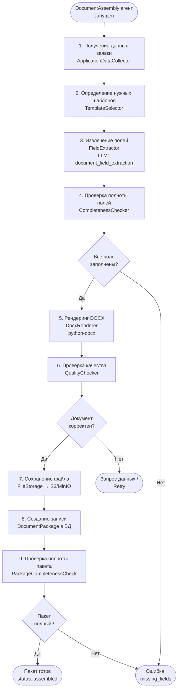

# Конвейер генерации документов (DOCX)

> **Статус документа:** проектная спецификация конвейера. Реализован пакет
> обычной самостоятельной заявки, но классы генераторов, форматы версий и
> специальные сценарии ниже могут отсутствовать. Фактический срез приведён в
> [`current-state.md`](current-state.md).

> **Версия:** 1.3
> **Дата:** 2026-09-01

---

## 1. Обзор

Конвейер формирует проверяемый рабочий DOCX заявления на основе данных дела.
После заполнения обязательных полей, подтверждения классов и завершения анализа
клиент может скачать ZIP для самостоятельной подачи простого случая. Архив
содержит папку юридически значимых файлов и отдельную справочную папку, поэтому
инструкция, расчёт и результат анализа не смешиваются с приложениями к заявке.
Защищённая финальная версия для профессионального контура требует утверждения
специалистом. Универсальный пакет всех специальных случаев пока не формируется.

### 1.1 Реализованный ZIP для самостоятельной подачи

```text
paket-dlya-podachi-{application_id}.zip
├── 01_ДЛЯ_ПОДАЧИ/
│   ├── 01_заявление.docx
│   ├── 02_перечень_товаров_и_услуг.docx
│   ├── 03_{изображение}                 # для графического/комбинированного знака
│   ├── 04_{аудиозапись}                 # MP3/WAV для звукового знака
│   ├── 05_{доверенность}                # при представительстве
│   └── 06_{документ_о_приоритете}       # при заявленном приоритете
├── 02_ДЛЯ_ВАС/
│   ├── 01_инструкция_по_подаче.docx
│   ├── 02_расчёт_пошлин.docx
│   ├── 03_результат_проверки.docx
│   └── 04_контрольный_список.txt
└── README.txt
```

Сервер блокирует скачивание, если обязательное поле не подтверждено, классы
МКТУ не утверждены, одна из двух проверок отсутствует/не завершена, не рассчитана
пошлина либо отсутствует применимое условное приложение.
Для звукового знака таким приложением является проверенная аудиозапись MP3/WAV.
Паспорт физического лица может храниться в материалах дела, но не включается в
папку подачи автоматически, чтобы не передавать лишние персональные данные.
Из него для карточки заявителя предлагаются только ФИО и адрес регистрации;
серия, номер, дата рождения, сведения о выдаче и код подразделения не
возвращаются клиентской форме. Статус пакета отдельно перечисляет паспорт как
исключённый чувствительный документ, чтобы это правило было видно до скачивания.
Назначение загруженного приложения должно быть подтверждено пользователем или
специалистом: результат автоматической классификации сам по себе недостаточен
для включения файла в юридически значимую папку.

**Принципы:**
- Разделение шаблона и данных: шаблоны хранятся отдельно от кода.
- Обязательная проверка полноты: пакет не считается готовым без всех обязательных документов.
- Версионирование: каждый сгенерированный документ имеет версию и контрольную сумму.
- Хранение: все версии документов сохраняются (immutable), новые генерации создают новые файлы.

### 1.2 Матрица юридической приёмки официального заявления

Автоматические тесты подтверждают техническое заполнение простого случая, но
не заменяют постраничное заключение юриста об актуальной форме. Перед внешним
пилотом юрист проверяет минимум по одному обезличенному образцу каждого типа:

| Область | Организация | ИП | Физическое лицо |
|---|---|---|---|
| Заявитель | полное наименование | ФИО и статус ИП | ФИО |
| Идентификаторы | ИНН, ОГРН, КПП где применим | ИНН, ОГРНИП | только применимые поля формы |
| Адрес и страна | адрес заявителя, `RU` по умолчанию | адрес заявителя, страна | адрес заявителя, страна |
| Подписант | ФИО, должность/полномочия | сам ИП либо представитель | заявитель либо представитель |
| Обозначение | один применимый вариант: текст либо изображение; (540) | то же | то же |
| Описание | поле (571), цвета только при заявлении цвета | то же | то же |
| Товары и услуги | полный официальный перечень позиций подтверждённого класса по умолчанию; сокращённый перечень только после явной правки клиента; при нехватке места — отдельное приложение | то же | то же |
| Условные отметки | вид знака, способ подачи, свидетельство, представитель, приоритет | то же | то же |
| Подписание | корректная подпись/ЭП и дата без имитации рисунком | то же | то же |
| Приложения | только применимые и подтверждённые | то же | то же |

Чек-лист приёмки хранит: версию и SHA-256 официального шаблона, версию
генератора, тип заявителя, идентификатор обезличенного образца, проверяющего,
дату, результат по каждому пункту и найденные расхождения. Задача считается
закрытой только после юридической подписи чек-листа и регрессионного теста на
каждое исправленное расхождение.

---

## 2. Реестр шаблонов

### 2.1 Обязательные шаблоны

| Код шаблона | Название документа | Описание | Версия |
|---|---|---|---|
| `trademark_application_form` | Заявление о регистрации ТЗ | Основное заявление по форме Роспатента | 2.1 |
| `goods_services_list` | Перечень товаров и/или услуг | Детализированный перечень по классам МКТУ | 1.3 |
| `power_of_attorney` | Доверенность представителя | Требуется только для выбранного в заявке представителя с основанием полномочий `power_of_attorney` | 1.1 |

### 2.2 Дополнительные шаблоны (по ситуации)

| Код шаблона | Название | Когда создаётся |
|---|---|---|
| `disclaimer_request` | Заявление о дискламации | Когда рекомендация — `proceed_with_modifications` с дискламацией |
| `priority_claim` | Заявление о приоритете | При конвенционном или выставочном приоритете |
| `response_to_office_action` | Ответ на запрос ФИПС | При получении `office_action_received` |
| `appeal_against_refusal` | Возражение против отказа | При `rejected` от ФИПС |

### 2.3 Реестр шаблонов (DocumentTemplateRegistry)

```python
# backend/app/documents/registry.py
# Реестр DOCX-шаблонов с метаданными полей

class DocumentTemplateRegistry:
    """Реестр всех шаблонов документов с описанием обязательных полей."""
    
    TEMPLATES = {
        "trademark_application_form": DocumentTemplateConfig(
            code="trademark_application_form",
            name_ru="Заявление о регистрации товарного знака",
            file_name="application_form_v2.1.docx",
            required_fields=[
                FieldSpec(name="applicant_full_name", type="str", description="Полное наименование заявителя"),
                FieldSpec(name="applicant_inn", type="str", description="ИНН заявителя"),
                FieldSpec(name="applicant_ogrn", type="str", description="ОГРН/ОГРНИП заявителя"),
                FieldSpec(name="applicant_legal_address", type="str", description="Юридический адрес"),
                FieldSpec(name="applicant_postal_address", type="str", description="Почтовый адрес для переписки"),
                FieldSpec(name="applicant_email", type="str", description="Email"),
                FieldSpec(name="applicant_phone", type="str", description="Телефон"),
                FieldSpec(name="mark_type_label", type="str", description="Вид обозначения"),
                FieldSpec(name="verbal_element", type="str", required_if="mark_type in ['word', 'combined']"),
                FieldSpec(name="color_claim", type="str", required=False, description="Заявляемые цвета"),
                FieldSpec(name="mark_description", type="str", required_if="mark_type in ['figurative', 'combined']"),
                FieldSpec(name="nice_classes_str", type="str", description="Перечень классов через запятую"),
                FieldSpec(name="representative_full_name", type="str", required_if="has_representative"),
                FieldSpec(name="filing_date", type="date", description="Дата подачи заявки"),
                FieldSpec(name="application_number", type="str", description="Внутренний номер заявки"),
            ],
            optional_fields=[
                FieldSpec(name="convention_priority_date", type="date"),
                FieldSpec(name="convention_priority_country", type="str"),
            ]
        ),
        
        "goods_services_list": DocumentTemplateConfig(
            code="goods_services_list",
            name_ru="Перечень товаров и/или услуг",
            file_name="goods_services_v1.3.docx",
            required_fields=[
                FieldSpec(name="application_number", type="str"),
                FieldSpec(name="applicant_short_name", type="str"),
                FieldSpec(name="goods_services_by_class", type="list[ClassItems]", description="Товары/услуги, сгруппированные по классам"),
            ]
        ),
        
        "power_of_attorney": DocumentTemplateConfig(
            code="power_of_attorney",
            name_ru="Доверенность",
            file_name="poa_v1.1.docx",
            required_fields=[
                FieldSpec(name="principal_full_name", type="str"),
                FieldSpec(name="principal_inn", type="str"),
                FieldSpec(name="representative_full_name", type="str"),
                FieldSpec(name="representative_passport_series", type="str"),
                FieldSpec(name="representative_passport_number", type="str"),
                FieldSpec(name="poa_date", type="date"),
                FieldSpec(name="poa_valid_until", type="date"),
            ]
        ),
    }
```

---

## 3. Конвейер генерации



### 3.1 Шаг 1: Сбор данных заявки (ApplicationDataCollector)

```python
# backend/app/documents/pipeline/data_collector.py
# Сборщик всех данных заявки для генерации документов

class ApplicationDataCollector:
    """Собирает и структурирует все данные, необходимые для документов."""
    
    async def collect(self, application_id: UUID) -> ApplicationDocumentData:
        """Загрузка всех связанных данных заявки из БД."""
        
        application = await self._app_repo.get_full(application_id)
        client = await self._client_repo.get_with_representatives(application.client_id)
        approved_classes = await self._get_approved_classes(application_id)
        recommendation = await self._rec_repo.get_approved(application_id)
        
        return ApplicationDocumentData(
            application=application,
            client=client,
            mark=application.mark,
            approved_classes=approved_classes,
            goods_services=approved_classes.goods_services_items,
            recommendation=recommendation,
            representative=client.primary_representative,
            filing_date=date.today(),
        )
```

### 3.2 Шаг 2: Выбор шаблонов (TemplateSelector)

```python
# backend/app/documents/pipeline/template_selector.py
# Определение необходимых шаблонов для конкретной заявки

class TemplateSelector:
    """Определяет набор шаблонов, необходимых для данной заявки."""
    
    def select(self, data: ApplicationDocumentData) -> list[str]:
        templates = ["trademark_application_form", "goods_services_list"]
        
        # Само наличие контакта в карточке клиента не включает представительство.
        # Доверенность нужна только выбранному в этой заявке представителю,
        # если его полномочия основаны именно на доверенности.
        if data.representative and data.representative.authority_type == "power_of_attorney":
            templates.append("power_of_attorney")
        
        # Дискламация нужна, если рекомендация содержит это действие
        if data.recommendation and self._needs_disclaimer(data.recommendation):
            templates.append("disclaimer_request")
        
        # Приоритет нужен, если заявлен конвенционный приоритет
        if data.application.metadata.get("convention_priority"):
            templates.append("priority_claim")
        
        return templates
```

### 3.3 Шаг 3: Извлечение полей (FieldExtractor)

Использует LLM (промпт `document_field_extraction`) для обогащения данных, плюс детерминированное маппинг:

```python
# backend/app/documents/pipeline/field_extractor.py
# Извлечение и форматирование полей для DOCX-шаблонов

class FieldExtractor:
    """Маппинг данных заявки в поля шаблонов документов."""
    
    # Детерминированный маппинг (без LLM)
    FIELD_MAPPINGS = {
        "trademark_application_form": {
            "applicant_full_name": lambda d: d.client.full_legal_name,
            "applicant_inn": lambda d: d.client.inn,
            "applicant_ogrn": lambda d: d.client.ogrn or "",
            "applicant_legal_address": lambda d: d.client.legal_address,
            "applicant_postal_address": lambda d: d.client.postal_address or d.client.legal_address,
            "applicant_email": lambda d: d.client.email,
            "applicant_phone": lambda d: d.client.phone or "",
            "mark_type_label": lambda d: MARK_TYPE_LABELS_RU[d.mark.mark_type],
            "verbal_element": lambda d: d.mark.verbal_element or "",
            "color_claim": lambda d: d.mark.color_claim or "",
            "mark_description": lambda d: d.mark.description or "",
            "nice_classes_str": lambda d: ", ".join(str(c) for c in sorted(d.approved_classes.class_numbers)),
            "filing_date": lambda d: d.filing_date.strftime("%d.%m.%Y"),
            "application_number": lambda d: d.application.application_number,
        }
    }
    
    async def extract(
        self, 
        template_code: str,
        data: ApplicationDocumentData,
    ) -> dict[str, Any]:
        """Извлечение полей: сначала детерминированные, затем LLM-ассист."""
        
        fields = {}
        template_config = self._registry.get(template_code)
        mapping = self.FIELD_MAPPINGS.get(template_code, {})
        
        # 1. Детерминированные поля
        for field_spec in template_config.required_fields:
            if field_spec.name in mapping:
                try:
                    fields[field_spec.name] = mapping[field_spec.name](data)
                except Exception as e:
                    # Поле не удалось вычислить — пометить как отсутствующее
                    fields[field_spec.name] = None
        
        # 2. LLM-ассист для полей, требующих интерпретации
        llm_needed = [f for f in template_config.required_fields 
                      if f.name not in fields or fields[f.name] is None]
        if llm_needed:
            llm_fields = await self._llm_extract(template_config, data, llm_needed)
            fields.update(llm_fields)
        
        return fields
```

### 3.4 Шаг 4: Проверка полноты (CompletenessChecker)

```python
# backend/app/documents/pipeline/completeness_checker.py
# Проверка полноты всех обязательных полей перед генерацией

class CompletenessChecker:
    """Строгая проверка наличия всех обязательных полей шаблона."""
    
    def check(
        self, 
        template_code: str, 
        fields: dict[str, Any],
        data: ApplicationDocumentData,
    ) -> CompletenessResult:
        
        config = self._registry.get(template_code)
        missing = []
        warnings = []
        
        for field_spec in config.required_fields:
            # Пропуск условно-обязательных полей
            if field_spec.required_if and not self._eval_condition(field_spec.required_if, data):
                continue
            
            value = fields.get(field_spec.name)
            if value is None or (isinstance(value, str) and not value.strip()):
                missing.append(MissingField(
                    field_name=field_spec.name,
                    description_ru=field_spec.description,
                    is_blocking=True,
                ))
            elif isinstance(value, str) and len(value) < 3:
                warnings.append(f"Поле '{field_spec.name}' подозрительно короткое: '{value}'")
        
        return CompletenessResult(
            is_complete=len(missing) == 0,
            missing_fields=missing,
            warnings=warnings,
        )
```

### 3.5 Шаг 5: Рендеринг DOCX (DocxRenderer)

```python
# backend/app/documents/pipeline/renderer.py
# Рендеринг DOCX-документа через python-docx с подстановкой полей

from docx import Document
from docx.shared import Pt, RGBColor
from copy import deepcopy

class DocxRenderer:
    """Рендеринг DOCX-документа путём замены плейсхолдеров в шаблоне."""
    
    PLACEHOLDER_PATTERN = r"\{\{(\w+)\}\}"  # Шаблон: {{field_name}}
    
    def render(
        self, 
        template_path: Path,
        fields: dict[str, Any],
    ) -> bytes:
        """Генерация DOCX: открывает шаблон, заменяет плейсхолдеры, возвращает bytes."""
        
        doc = Document(template_path)
        
        # Обход всех параграфов и таблиц
        for paragraph in doc.paragraphs:
            self._replace_in_paragraph(paragraph, fields)
        
        for table in doc.tables:
            for row in table.rows:
                for cell in row.cells:
                    for paragraph in cell.paragraphs:
                        self._replace_in_paragraph(paragraph, fields)
        
        # Замена в верхних/нижних колонтитулах
        for section in doc.sections:
            for paragraph in section.header.paragraphs:
                self._replace_in_paragraph(paragraph, fields)
            for paragraph in section.footer.paragraphs:
                self._replace_in_paragraph(paragraph, fields)
        
        # Сохранение в байты
        buffer = io.BytesIO()
        doc.save(buffer)
        return buffer.getvalue()
    
    def _replace_in_paragraph(self, paragraph, fields: dict):
        """Замена плейсхолдеров в параграфе с сохранением форматирования."""
        # Работа на уровне runs для сохранения стилей
        full_text = "".join(run.text for run in paragraph.runs)
        if not re.search(self.PLACEHOLDER_PATTERN, full_text):
            return
        
        # Замена значений
        new_text = re.sub(
            self.PLACEHOLDER_PATTERN,
            lambda m: str(fields.get(m.group(1), f"[ОТСУТСТВУЕТ: {m.group(1)}]")),
            full_text,
        )
        
        # Очистка и перезапись первого run
        if paragraph.runs:
            paragraph.runs[0].text = new_text
            for run in paragraph.runs[1:]:
                run.text = ""
```

---

## 4. Проверка качества сгенерированного документа (QualityChecker)

```python
# backend/app/documents/pipeline/quality_checker.py
# Проверки качества сгенерированного DOCX-документа

class DocumentQualityChecker:
    """Проверка корректности сгенерированного документа."""
    
    def check(self, docx_bytes: bytes, template_code: str) -> QualityCheckResult:
        issues = []
        
        # 1. Проверка: нет незамещённых плейсхолдеров
        doc = Document(io.BytesIO(docx_bytes))
        full_text = self._extract_full_text(doc)
        
        unresolved = re.findall(r"\{\{(\w+)\}\}", full_text)
        if unresolved:
            issues.append(QualityIssue(
                severity="error",
                description=f"Незамещённые плейсхолдеры: {unresolved}",
            ))
        
        # 2. Проверка: маркер [ОТСУТСТВУЕТ:...] не должен быть в финальном документе
        absent_markers = re.findall(r"\[ОТСУТСТВУЕТ: \w+\]", full_text)
        if absent_markers:
            issues.append(QualityIssue(
                severity="error",
                description=f"Отсутствующие поля: {absent_markers}",
            ))
        
        # 3. Проверка минимальной длины текста
        if len(full_text.strip()) < 100:
            issues.append(QualityIssue(severity="error", description="Документ подозрительно короткий"))
        
        # 4. Специфичные для шаблона проверки
        if template_code == "trademark_application_form":
            if not re.search(r"\d{10,12}", full_text):  # ИНН
                issues.append(QualityIssue(severity="warning", description="Не найден ИНН в документе"))
        
        return QualityCheckResult(
            is_valid=not any(i.severity == "error" for i in issues),
            issues=issues,
        )
```

---

## 5. Версионирование документов

### 5.1 Принцип неизменяемости

Сгенерированные файлы **никогда не изменяются**. Каждое перегенерирование создаёт новый файл:

```
storage/
└── applications/
    └── {application_id}/
        └── documents/
            ├── {package_id_v1}/
            │   ├── application_form_v2.1_20260325_143000.docx
            │   ├── goods_services_v1.3_20260325_143000.docx
            │   └── power_of_attorney_v1.1_20260325_143000.docx
            └── {package_id_v2}/             ← Перегенерация после правок
                ├── application_form_v2.1_20260329_091500.docx
                └── goods_services_v1.3_20260329_091500.docx
```

### 5.2 Именование файлов

```
{template_code}_{template_version}_{YYYYMMDD}_{HHMMSS}.docx
```

Пример: `trademark_application_form_v2.1_20260329_091500.docx`

### 5.3 Метаданные файла (в БД)

```python
class GeneratedDocument(BaseModel):
    id: UUID
    package_id: UUID
    template_code: str
    template_version: str
    file_name: str
    file_path: str          # Путь в S3/MinIO
    file_size_bytes: int
    checksum_sha256: str    # Для верификации целостности
    generated_at: datetime
    generated_by_agent_run: UUID
    # Поля для аудита (без PII)
    field_names_populated: list[str]
    field_names_missing: list[str]
```

---

## 6. Проверка полноты пакета (PackageCompletenessCheck)

```python
# backend/app/documents/pipeline/package_checker.py
# Проверка полноты всего пакета документов

class PackageCompletenessChecker:
    """Финальная проверка полноты комплекта документов для подачи."""
    
    def check(
        self,
        generated_documents: list[GeneratedDocument],
        required_templates: list[str],
    ) -> PackageCompletenessResult:
        
        generated_codes = {d.template_code for d in generated_documents}
        missing = [code for code in required_templates if code not in generated_codes]
        
        quality_errors = [d for d in generated_documents if d.has_quality_errors]
        
        return PackageCompletenessResult(
            is_complete=len(missing) == 0 and len(quality_errors) == 0,
            missing_documents=[
                {"template_code": code, "name_ru": TEMPLATE_NAMES_RU[code]}
                for code in missing
            ],
            documents_with_errors=[
                {"template_code": d.template_code, "errors": d.quality_issues}
                for d in quality_errors
            ],
            total_documents=len(generated_documents),
            required_documents=len(required_templates),
        )
```

---

## 7. Хранилище файлов

### 7.1 Структура объектов S3/MinIO

```
trademark-system-docs/        # Bucket
├── applications/
│   └── {app_id}/
│       ├── marks/            # Изображения обозначений
│       │   └── mark_original.{png,jpg,svg}
│       └── packages/
│           └── {package_id}/
│               ├── documents/ # DOCX-файлы пакета
│               └── manifest.json # Список файлов с чексуммами
├── templates/
│   └── {template_code}/
│       └── {version}/
│           └── template.docx
└── knowledge-base/
    └── sources/
        └── {source_code}/
            └── {version}/
                └── document.pdf
```

### 7.2 Политика доступа к файлам

- Документы заявки — presigned URL (срок 1 час) для скачивания.
- Шаблоны — read-only для backend-сервиса.
- Загрузка изображений обозначений — через endpoint `/documents/{id}/upload`.

---

## 8. Обработка изображений обозначений

Для изобразительных и комбинированных ТЗ:

1. **Принятые форматы:** PNG, JPEG, SVG, TIFF.
2. **Требования ФИПС:** ≥ 300 DPI, чёрно-белое или цветное.
3. **Конвертация:** автоматически через Pillow (если не соответствует требованиям).
4. **Вставка в DOCX:** через `Document.add_picture()` с фиксированными размерами (5×5 см).

```python
# backend/app/documents/pipeline/image_processor.py
# Обработка изображений обозначений для вставки в документы

class MarkImageProcessor:
    """Подготовка изображения ТЗ для вставки в документы."""
    
    REQUIRED_DPI = 300
    MAX_SIZE_CM = (10, 10)
    ACCEPTED_FORMATS = {"PNG", "JPEG", "TIFF", "SVG"}
    
    async def prepare_for_document(
        self,
        image_path: str,
        target_width_cm: float = 5.0,
    ) -> PreparedImage:
        """Загрузка и подготовка изображения согласно требованиям ФИПС."""
        ...
```
