# Доменная модель системы регистрации товарных знаков

> **Статус на 15.08.2026:** документ содержит исходную целевую модель. Реальная
> схема SQLAlchemy является источником правды; часть полей, UUID, soft delete и
> связей из спецификации может отсутствовать. Текущий маршрут доступа описан в
> [`current-state.md`](current-state.md).

> **Версия:** 1.0  
> **Дата:** 2026-03-29

---

## 1. Обзор доменной модели

Доменная модель построена вокруг агрегата `TrademarkApplicationDraft`, который является центральным объектом жизненного цикла. Все остальные сущности либо являются его дочерними, либо связаны с ним через ссылочные идентификаторы.

---

## 2. ER-диаграмма (Mermaid)

```mermaid
erDiagram
    User {
        uuid id PK
        string email UK
        string hashed_password
        enum role "admin|lawyer|manager|client"
        string full_name
        bool is_active
        datetime created_at
        datetime updated_at
        uuid created_by_id FK
    }

    Client {
        uuid id PK
        enum client_type "individual|legal_entity|sole_proprietor"
        string short_name
        string full_legal_name
        string inn UK
        string ogrn
        string legal_address
        string postal_address
        string email
        string phone
        bool is_active
        datetime created_at
        datetime updated_at
        uuid manager_id FK
    }

    ClientRepresentative {
        uuid id PK
        uuid client_id FK
        string full_name
        string position
        string email
        string phone
        enum authority_type "power_of_attorney|charter|order"
        string authority_document_number
        date authority_document_date
        date authority_valid_until
        bool is_primary
        datetime created_at
    }

    TrademarkApplicationDraft {
        uuid id PK
        string application_number UK
        uuid client_id FK
        uuid responsible_lawyer_id FK
        uuid manager_id FK
        enum status "draft|awaiting_client_data|intake_review|legal_precheck_running|awaiting_lawyer_review|classes_review|conflict_search_running|recommendation_ready|docs_preparation|awaiting_doc_approval|ready_for_submission|submitted|status_monitoring|office_action_received|client_action_required|completed|rejected|archived"
        enum mark_type "word|figurative|combined|3d|sound|color"
        string working_title
        jsonb metadata
        datetime created_at
        datetime updated_at
        uuid created_by_id FK
        datetime submitted_at
        datetime completed_at
    }

    TrademarkMark {
        uuid id PK
        uuid application_id FK
        enum mark_type "word|figurative|combined|3d|sound|color"
        string verbal_element
        text description
        string image_file_path
        string color_claim
        string transliteration
        string translation
        bool is_color_claimed
        jsonb additional_params
        datetime created_at
        datetime updated_at
    }

    GoodsServicesItem {
        uuid id PK
        uuid application_id FK
        int nice_class_number
        string item_text_ru
        string item_text_en
        enum source "manual|suggested_by_agent|imported"
        bool is_approved
        uuid approved_by_id FK
        datetime approved_at
        datetime created_at
    }

    NiceClassSuggestion {
        uuid id PK
        uuid application_id FK
        int nice_class_number
        text reasoning
        float confidence_score
        jsonb suggested_items
        enum status "pending|approved|rejected|modified"
        uuid reviewed_by_id FK
        text review_comment
        datetime reviewed_at
        string agent_run_id FK
        datetime created_at
    }

    LegalReview {
        uuid id PK
        uuid application_id FK
        enum review_type "absolute_grounds|relative_grounds|full"
        enum status "pending|running|completed|failed|awaiting_lawyer_approval"
        text summary_ru
        enum overall_risk "low|medium|high|blocking"
        uuid reviewed_by_id FK
        datetime lawyer_approved_at
        text lawyer_comment
        string agent_run_id FK
        datetime started_at
        datetime completed_at
        datetime created_at
    }

    LegalFinding {
        uuid id PK
        uuid legal_review_id FK
        enum finding_type "absolute_ground|relative_ground|info|recommendation"
        enum severity "info|warning|risk|blocking"
        string article_reference
        text description_ru
        text recommendation_ru
        jsonb rag_citations
        float confidence_score
        datetime created_at
    }

    ConflictSearchJob {
        uuid id PK
        uuid application_id FK
        enum status "queued|running|completed|failed|cancelled"
        jsonb search_queries
        jsonb search_params
        int results_count
        string fips_request_id
        string agent_run_id FK
        datetime queued_at
        datetime started_at
        datetime completed_at
        text error_message
    }

    ConflictSearchResult {
        uuid id PK
        uuid conflict_search_job_id FK
        string fips_trademark_number
        string fips_trademark_title
        string owner_name
        jsonb nice_classes
        enum similarity_type "phonetic|semantic|visual|combined"
        float similarity_score
        enum status "active|expired|cancelled"
        enum risk_level "low|medium|high|blocking"
        text analysis_notes_ru
        date registration_date
        date expiry_date
        datetime created_at
    }

    RecommendationMemo {
        uuid id PK
        uuid application_id FK
        enum recommendation "proceed|proceed_with_modifications|request_disclaimer|abandon"
        text executive_summary_ru
        text legal_analysis_ru
        text risk_assessment_ru
        text proposed_actions_ru
        jsonb rag_citations
        float overall_confidence
        enum status "draft|awaiting_approval|approved|rejected"
        uuid approved_by_id FK
        text approval_comment
        datetime approved_at
        string agent_run_id FK
        datetime created_at
        datetime updated_at
    }

    DocumentTemplate {
        uuid id PK
        string template_code UK
        string name_ru
        text description_ru
        string file_path
        string version
        jsonb required_fields
        jsonb optional_fields
        bool is_active
        datetime created_at
        datetime updated_at
        uuid created_by_id FK
    }

    DocumentPackage {
        uuid id PK
        uuid application_id FK
        string package_version
        enum status "assembling|assembled|awaiting_approval|approved|rejected|submitted"
        jsonb documents
        uuid assembled_by_id FK
        datetime assembled_at
        uuid approved_by_id FK
        text approval_comment
        datetime approved_at
        text rejection_reason
        string agent_run_id FK
        datetime created_at
        datetime updated_at
    }

    Submission {
        uuid id PK
        uuid application_id FK
        uuid document_package_id FK
        enum channel "fips_api|fips_portal_manual|email"
        enum status "pending|in_progress|submitted|acknowledged|failed"
        string fips_receipt_number
        string fips_request_id
        datetime submitted_at
        text error_message
        jsonb submission_metadata
        datetime created_at
        datetime updated_at
    }

    SubmissionStatusEvent {
        uuid id PK
        uuid submission_id FK
        enum event_type "status_change|office_action|decision|fee_request|extension_granted"
        string previous_status
        string new_status
        text description_ru
        jsonb raw_fips_payload
        datetime event_date
        datetime received_at
        bool requires_client_action
        date action_deadline
        datetime created_at
    }

    Notification {
        uuid id PK
        uuid application_id FK
        uuid recipient_user_id FK
        enum channel "email|telegram|in_app"
        enum notification_type "status_change|action_required|document_ready|deadline_reminder|agent_completed"
        string subject
        text body_html
        text body_text
        enum status "pending|sent|failed|read"
        int retry_count
        datetime scheduled_at
        datetime sent_at
        text error_message
        datetime created_at
    }

    AuditLog {
        uuid id PK
        uuid user_id FK
        string session_id
        enum entity_type "application|client|document|submission|user|prompt|agent_run"
        uuid entity_id
        string action
        jsonb before_state
        jsonb after_state
        string ip_address
        string user_agent
        string request_id
        datetime created_at
    }

    PromptDefinition {
        uuid id PK
        string prompt_code UK
        string name_ru
        text description_ru
        text template
        jsonb input_variables
        jsonb output_schema
        string version
        bool is_active
        string model_override
        float temperature
        int max_tokens
        datetime created_at
        datetime updated_at
        uuid created_by_id FK
    }

    AgentRun {
        uuid id PK
        uuid application_id FK
        string agent_name
        string langgraph_run_id UK
        enum status "pending|running|completed|failed|interrupted"
        jsonb input_state
        jsonb output_state
        jsonb checkpoints
        text error_message
        string error_traceback
        int llm_calls_count
        int total_tokens_used
        float duration_seconds
        datetime started_at
        datetime completed_at
        datetime created_at
    }

    KnowledgeSource {
        uuid id PK
        string source_code UK
        string name_ru
        enum source_type "law_text|regulation|guideline|internal_methodology|case_law"
        string version
        string url
        string file_path
        enum status "pending|processing|active|outdated|error"
        date effective_date
        date valid_until
        jsonb metadata
        datetime created_at
        datetime updated_at
        uuid created_by_id FK
    }

    KnowledgeChunk {
        uuid id PK
        uuid knowledge_source_id FK
        int chunk_index
        text content_ru
        string section_title
        string article_reference
        vector embedding
        jsonb metadata
        int token_count
        datetime created_at
        datetime updated_at
    }

    BackgroundJob {
        uuid id PK
        string job_code
        enum job_type "status_poll|notification_send|rag_ingest|agent_retry|report_generate"
        enum status "scheduled|running|completed|failed|cancelled"
        uuid application_id FK
        jsonb params
        int retry_count
        int max_retries
        text error_message
        datetime scheduled_at
        datetime started_at
        datetime completed_at
        datetime created_at
    }

    %% Связи
    Client ||--o{ ClientRepresentative : "имеет"
    Client ||--o{ TrademarkApplicationDraft : "подаёт"
    User ||--o{ TrademarkApplicationDraft : "ведёт (юрист)"
    TrademarkApplicationDraft ||--|| TrademarkMark : "содержит обозначение"
    TrademarkApplicationDraft ||--o{ GoodsServicesItem : "включает товары/услуги"
    TrademarkApplicationDraft ||--o{ NiceClassSuggestion : "имеет предложения классов"
    TrademarkApplicationDraft ||--o{ LegalReview : "проходит экспертизу"
    LegalReview ||--o{ LegalFinding : "содержит выводы"
    TrademarkApplicationDraft ||--o{ ConflictSearchJob : "имеет поиски конфликтов"
    ConflictSearchJob ||--o{ ConflictSearchResult : "содержит результаты"
    TrademarkApplicationDraft ||--o{ RecommendationMemo : "получает рекомендацию"
    TrademarkApplicationDraft ||--o{ DocumentPackage : "формирует пакет"
    DocumentTemplate ||--o{ DocumentPackage : "используется в"
    TrademarkApplicationDraft ||--o| Submission : "подаётся"
    Submission ||--o{ SubmissionStatusEvent : "имеет события"
    TrademarkApplicationDraft ||--o{ Notification : "генерирует уведомления"
    TrademarkApplicationDraft ||--o{ AgentRun : "запускает агентов"
    TrademarkApplicationDraft ||--o{ AuditLog : "журналируется"
    KnowledgeSource ||--o{ KnowledgeChunk : "разбивается на чанки"
    User ||--o{ AuditLog : "создаёт записи"
```

---

## 3. Детальное описание сущностей

### 3.1 User (Системный пользователь)

Представляет сотрудника фирмы или клиента с доступом к системе.

| Поле | Тип | Описание |
|---|---|---|
| `id` | UUID | Первичный ключ |
| `email` | string (unique) | Логин / адрес электронной почты |
| `hashed_password` | string | Bcrypt-хэш пароля |
| `role` | enum | Роль: `admin`, `lawyer`, `manager`, `client` |
| `full_name` | string | Полное ФИО |
| `is_active` | bool | Признак активности аккаунта |
| `created_at` | datetime | Дата создания |
| `created_by_id` | UUID (FK) | Кто создал аккаунт |

**Инварианты:** Email уникален. Клиент-пользователь привязывается к записи `Client` через `Client.user_id`. Смена роли записывается в `AuditLog`.

---

### 3.2 Client (Клиент фирмы)

Юридическое или физическое лицо, подающее заявку на регистрацию ТЗ.

| Поле | Тип | Описание |
|---|---|---|
| `client_type` | enum | `individual` / `legal_entity` / `sole_proprietor` |
| `inn` | string (unique) | ИНН (обязательно для ЮЛ и ИП) |
| `ogrn` | string | ОГРН / ОГРНИП |
| `full_legal_name` | string | Полное наименование |
| `manager_id` | UUID (FK) | Менеджер фирмы, ведущий клиента |

**Инварианты:** ИНН уникален в системе. Для `legal_entity` обязателен `ogrn`. Удаление клиента — только soft delete (`is_active = false`).

---

### 3.3 TrademarkApplicationDraft (Заявка на регистрацию ТЗ)

Главный агрегат системы. Содержит всё состояние заявки и управляет жизненным циклом.

| Поле | Тип | Описание |
|---|---|---|
| `application_number` | string (unique) | Внутренний номер (генерируется автоматически: `TZ-YYYY-NNNNN`) |
| `status` | enum | Текущее состояние (см. state-machine.md) |
| `mark_type` | enum | Тип обозначения |
| `responsible_lawyer_id` | UUID (FK) | Юрист, ответственный за заявку |
| `metadata` | JSONB | Дополнительные поля (расширяемые без миграции) |

**Инварианты:** Переход статуса возможен только через `ApplicationService.transition_status()`. Каждый переход записывается в `AuditLog`.

---

### 3.4 TrademarkMark (Обозначение товарного знака)

Детальное описание регистрируемого обозначения.

| Поле | Тип | Описание |
|---|---|---|
| `verbal_element` | string | Словесный элемент (для словесных и комбинированных ТЗ) |
| `description` | text | Описание изображения (для изобразительных ТЗ) |
| `image_file_path` | string | Путь к файлу изображения в хранилище |
| `color_claim` | string | Заявляемые цвета (по системе Pantone или RGB) |
| `transliteration` | string | Транслитерация словесного элемента |

**Инварианты:** Для `figurative` и `combined` обязателен `image_file_path`. Для `word` обязателен `verbal_element`.

---

### 3.5 GoodsServicesItem (Товар или услуга)

Отдельная позиция перечня товаров/услуг заявки.

| Поле | Тип | Описание |
|---|---|---|
| `nice_class_number` | int | Номер класса МКТУ (1–45) |
| `item_text_ru` | string | Наименование на русском |
| `source` | enum | Источник: `manual` / `suggested_by_agent` / `imported` |
| `is_approved` | bool | Утверждён юристом |

---

### 3.6 LegalReview (Правовая экспертиза)

Результат экспертизы по абсолютным и/или относительным основаниям (ст. 1483 ГК РФ).

| Поле | Тип | Описание |
|---|---|---|
| `review_type` | enum | `absolute_grounds` / `relative_grounds` / `full` |
| `overall_risk` | enum | Итоговый уровень риска: `low` / `medium` / `high` / `blocking` |
| `summary_ru` | text | Краткое резюме на русском языке |
| `lawyer_approved_at` | datetime | Дата утверждения юристом (HITL checkpoint 1) |

---

### 3.7 LegalFinding (Правовой вывод)

Отдельный вывод в рамках правовой экспертизы с ссылкой на норму права.

| Поле | Тип | Описание |
|---|---|---|
| `finding_type` | enum | `absolute_ground` / `relative_ground` / `info` / `recommendation` |
| `severity` | enum | `info` / `warning` / `risk` / `blocking` |
| `article_reference` | string | Ссылка на статью (напр.: «ст. 1483, п. 1, пп. 1 ГК РФ») |
| `rag_citations` | JSONB | Массив ссылок на чанки базы знаний |
| `confidence_score` | float | Уверенность агента (0.0–1.0) |

---

### 3.8 ConflictSearchJob / ConflictSearchResult

`ConflictSearchJob` — задание поиска конфликтующих обозначений в базе ФИПС.  
`ConflictSearchResult` — найденный конфликтующий ТЗ с оценкой сходства.

| Поле | Тип | Описание |
|---|---|---|
| `fips_trademark_number` | string | Регномер ТЗ в базе ФИПС |
| `similarity_type` | enum | Тип сходства: фонетическое / семантическое / визуальное / комбинированное |
| `similarity_score` | float | Степень сходства (0.0–1.0) |
| `risk_level` | enum | Уровень конфликтного риска |

---

### 3.9 RecommendationMemo (Рекомендательная записка)

Итоговый документ с рекомендацией по дальнейшим действиям (HITL checkpoint 3).

| Поле | Тип | Описание |
|---|---|---|
| `recommendation` | enum | `proceed` / `proceed_with_modifications` / `request_disclaimer` / `abandon` |
| `executive_summary_ru` | text | Краткое изложение для клиента |
| `rag_citations` | JSONB | Источники из базы знаний |
| `overall_confidence` | float | Общая уверенность агента |

---

### 3.10 DocumentTemplate / DocumentPackage

`DocumentTemplate` — DOCX-шаблон документа с описанием обязательных полей.  
`DocumentPackage` — собранный комплект документов для подачи (HITL checkpoint 4).

| Поле `DocumentTemplate` | Тип | Описание |
|---|---|---|
| `template_code` | string (unique) | Идентификатор шаблона (напр.: `trademark_application_form`) |
| `required_fields` | JSONB | Список обязательных полей с типами |
| `version` | string | Версия шаблона (semver) |

---

### 3.11 Submission / SubmissionStatusEvent

`Submission` — факт подачи документов в ФИПС.  
`SubmissionStatusEvent` — каждое изменение статуса от ФИПС (приход уведомлений).

---

### 3.12 KnowledgeSource / KnowledgeChunk

`KnowledgeSource` — источник правовых знаний (закон, регламент, методология).  
`KnowledgeChunk` — отдельный чанк источника с векторным эмбеддингом для RAG.

| Поле `KnowledgeChunk` | Тип | Описание |
|---|---|---|
| `embedding` | vector(1536) | Векторное представление текста |
| `article_reference` | string | Ссылка на статью/пункт для цитирования |
| `token_count` | int | Размер чанка в токенах |

---

### 3.13 AgentRun (Запуск агента)

Трассировка каждого запуска LangGraph-агента.

| Поле | Тип | Описание |
|---|---|---|
| `langgraph_run_id` | string (unique) | ID запуска в LangGraph |
| `input_state` | JSONB | Входное состояние графа |
| `output_state` | JSONB | Выходное состояние графа |
| `checkpoints` | JSONB | Снимки состояния на каждом узле |
| `total_tokens_used` | int | Суммарный расход токенов |

---

### 3.14 AuditLog (Журнал аудита)

Неизменяемая запись каждого значимого действия. Таблица только для вставки (append-only).

| Поле | Тип | Описание |
|---|---|---|
| `entity_type` | enum | Тип изменённой сущности |
| `before_state` | JSONB | Состояние до изменения (может быть null) |
| `after_state` | JSONB | Состояние после изменения |
| `request_id` | string | ID HTTP-запроса для корреляции |

**Инварианты:** Записи не обновляются и не удаляются. Индекс по `(entity_type, entity_id)` и `(user_id, created_at)`.

---

### 3.15 PromptDefinition (Определение промпта)

Версионируемый промпт из реестра.

| Поле | Тип | Описание |
|---|---|---|
| `prompt_code` | string (unique) | Идентификатор промпта (напр.: `absolute_grounds_check`) |
| `input_variables` | JSONB | Список переменных и их типы |
| `output_schema` | JSONB | JSON Schema для валидации выхода LLM |
| `temperature` | float | Температура для данного промпта |
| `model_override` | string | Принудительная замена модели (опционально) |

---

## 4. Агрегаты и границы транзакций

| Агрегат | Корень | Дочерние сущности |
|---|---|---|
| **Application** | `TrademarkApplicationDraft` | `TrademarkMark`, `GoodsServicesItem`, `NiceClassSuggestion`, `LegalReview` + `LegalFinding`, `ConflictSearchJob` + `ConflictSearchResult`, `RecommendationMemo`, `DocumentPackage`, `Submission` + `SubmissionStatusEvent` |
| **Client** | `Client` | `ClientRepresentative` |
| **KnowledgeBase** | `KnowledgeSource` | `KnowledgeChunk` |
| **Audit** | `AuditLog` | — (атомарные записи) |

**Правило:** Транзакции не пересекают границы агрегатов. Межагрегатное взаимодействие — через domain events или идентификаторы.

---

## 5. Доменные события

| Событие | Источник | Подписчики |
|---|---|---|
| `ApplicationStatusChanged` | `ApplicationService` | `NotificationService`, `AuditService` |
| `LegalReviewCompleted` | `LegalReviewService` | `ApplicationService` (→ `awaiting_lawyer_review`) |
| `ConflictSearchCompleted` | `ConflictSearchService` | `ApplicationService`, `NotificationService` |
| `DocumentPackageApproved` | `DocumentService` | `ApplicationService` (→ `ready_for_submission`) |
| `SubmissionAcknowledged` | `SubmissionService` | `ApplicationService` (→ `status_monitoring`) |
| `OfficeActionReceived` | `StatusTrackingService` | `ApplicationService`, `NotificationService` |
| `AgentRunCompleted` | `AgentRunner` | `AuditService` |
| `AgentRunFailed` | `AgentRunner` | `NotificationService` (alert admin) |
