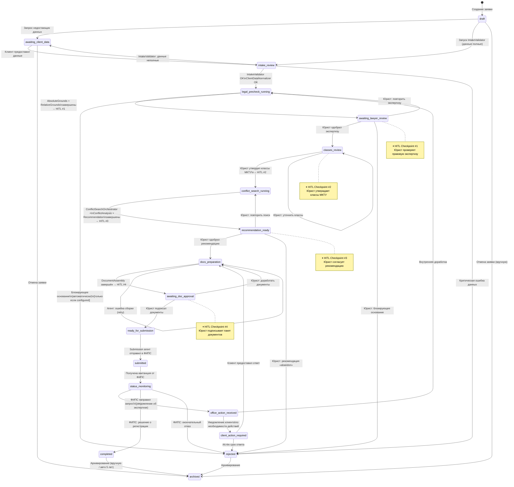

# Машина состояний заявки на регистрацию товарного знака

> **Статус документа:** целевая спецификация, частично расходящаяся с текущим
> enum и картой переходов в `backend/app/services/state_machine.py`. Источник
> правды для переходов — код и API; общий срез приведён в
> [`current-state.md`](current-state.md).

> **Версия:** 1.0  
> **Дата:** 2026-03-29

---

## 1. Обзор

Статус заявки `TrademarkApplicationDraft.status` управляется строгой машиной состояний. Прямое обновление поля `status` в БД запрещено; все переходы происходят только через `ApplicationService.transition_status()`, который:

1. Проверяет допустимость перехода.
2. Записывает событие в `AuditLog`.
3. Генерирует `ApplicationStatusChanged` domain event.
4. Запускает сопутствующие side-effects (уведомления, агенты).

---

## 2. Полная диаграмма состояний



---

## 3. Таблица состояний

| Статус | Русское название | Фаза | Описание |
|---|---|---|---|
| `draft` | Черновик | Приём | Заявка создана, данные не проверены |
| `awaiting_client_data` | Ожидание данных от клиента | Приём | Запрошены недостающие данные |
| `intake_review` | Первичная проверка | Приём | Агенты IntakeValidator + ClientDataNormalizer работают |
| `legal_precheck_running` | Правовая экспертиза | Правовой анализ | Агенты AbsoluteGrounds + RelativeGrounds работают |
| `awaiting_lawyer_review` | На проверке юриста | Правовой анализ | HITL #1: юрист рассматривает результаты |
| `classes_review` | Проверка классов МКТУ | Классификация | HITL #2: юрист утверждает классы |
| `conflict_search_running` | Поиск конфликтов | Конфликтный поиск | Агенты ConflictSearch + Analysis работают |
| `recommendation_ready` | Рекомендация готова | Рекомендация | HITL #3: юрист согласует рекомендацию |
| `docs_preparation` | Подготовка документов | Документы | Агент DocumentAssembly работает |
| `awaiting_doc_approval` | Ожидание подписания | Документы | HITL #4: юрист подписывает документы |
| `ready_for_submission` | Готово к подаче | Подача | Документы утверждены, ожидают отправки |
| `submitted` | Подано в ФИПС | Подача | Документы отправлены, ожидается квитанция |
| `status_monitoring` | Мониторинг статуса | После подачи | Периодический опрос ФИПС |
| `office_action_received` | Получен запрос ФИПС | После подачи | ФИПС направил запрос или уведомление |
| `client_action_required` | Требуется действие клиента | После подачи | Клиент должен предоставить ответ |
| `completed` | Завершено | Финал | Товарный знак зарегистрирован |
| `rejected` | Отказ | Финал | Отказ в регистрации (ФИПС или внутренний) |
| `archived` | Архив | Финал | Заявка архивирована |

---

## 4. Допустимые переходы (матрица)

| Из \ В | `awaiting_client_data` | `intake_review` | `legal_precheck_running` | `awaiting_lawyer_review` | `classes_review` | `conflict_search_running` | `recommendation_ready` | `docs_preparation` | `awaiting_doc_approval` | `ready_for_submission` | `submitted` | `status_monitoring` | `office_action_received` | `client_action_required` | `completed` | `rejected` | `archived` |
|---|:---:|:---:|:---:|:---:|:---:|:---:|:---:|:---:|:---:|:---:|:---:|:---:|:---:|:---:|:---:|:---:|:---:|
| `draft` | ✓ | ✓ | | | | | | | | | | | | | | | ✓ |
| `awaiting_client_data` | | ✓ | | | | | | | | | | | | | | | ✓ |
| `intake_review` | ✓ | | ✓ | | | | | | | | | | | | | ✓ | |
| `legal_precheck_running` | | | | ✓ | | | | | | | | | | | | ✓ | |
| `awaiting_lawyer_review` | | | ✓ | | ✓ | | | | | | | | | | | ✓ | |
| `classes_review` | | | | | ✓ | ✓ | | | | | | | | | | | |
| `conflict_search_running` | | | | | | | ✓ | | | | | | | | | | |
| `recommendation_ready` | | | | | | ✓ | | ✓ | | | | | | | | ✓ | |
| `docs_preparation` | | | | | | | | ✓ | ✓ | | | | | | | | |
| `awaiting_doc_approval` | | | | | | | | ✓ | | ✓ | | | | | | | |
| `ready_for_submission` | | | | | | | | | | | ✓ | | | | | | |
| `submitted` | | | | | | | | | | | | ✓ | | | | | |
| `status_monitoring` | | | | | | | | | | | | ✓ | ✓ | | ✓ | ✓ | |
| `office_action_received` | | | ✓ | | | | | | | | | | | ✓ | | | |
| `client_action_required` | | | | | | | | ✓ | | | | | | | | ✓ | |
| `completed` | | | | | | | | | | | | | | | | | ✓ |
| `rejected` | | | | | | | | | | | | | | | | | ✓ |

---

## 5. Правила переходов

### 5.1 draft → intake_review

**Условия:**
- `TrademarkMark` заполнен (verbal_element или image_file_path)
- `Client` привязан и активен
- `responsible_lawyer_id` назначен
- `preliminary_goods_services` не пустой

**Триггер:** Ручной (менеджер/юрист) или автоматический при сохранении заявки.

---

### 5.2 intake_review → legal_precheck_running

**Условия:**
- `IntakeValidatorOutput.can_proceed == true`
- `ClientDataNormalizerOutput` успешно создан
- Нет блокирующих `missing_fields`

**Триггер:** Автоматический (по завершению агента IntakeValidator).

---

### 5.3 legal_precheck_running → awaiting_lawyer_review

**Условия:**
- `LegalReview.status == "completed"` для обоих типов экспертизы
- `HumanReviewPacket` создан с `checkpoint_type == HITL_1`

**Триггер:** Автоматический (по завершению агента HumanReviewPacket).

---

### 5.4 awaiting_lawyer_review → classes_review

**Условия:**
- `LegalReview.lawyer_approved_at` заполнен
- `LegalReview.overall_risk != "blocking"` (или юрист явно переопределил)
- Пользователь имеет роль `lawyer`

**Триггер:** HITL — вызов `POST /applications/{id}/legal-review/approve` с `decision="approved"`.

---

### 5.5 classes_review → conflict_search_running

**Условия:**
- Хотя бы один `NiceClassSuggestion.status == "approved"`
- Хотя бы один `GoodsServicesItem.is_approved == true`
- Пользователь имеет роль `lawyer`

**Триггер:** HITL — вызов `POST /applications/{id}/classes/approve`.

---

### 5.6 conflict_search_running → recommendation_ready

**Условия:**
- `ConflictSearchJob.status == "completed"`
- `RecommendationMemo.status == "draft"` создан

**Триггер:** Автоматический (по завершению агента Recommendation).

---

### 5.7 recommendation_ready → docs_preparation

**Условия:**
- `RecommendationMemo.status == "approved"`
- `RecommendationMemo.recommendation != "abandon"`
- Пользователь имеет роль `lawyer`

**Триггер:** HITL — вызов `POST /applications/{id}/recommendation/approve`.

---

### 5.8 awaiting_doc_approval → ready_for_submission

**Условия:**
- `DocumentPackage.status == "approved"`
- `DocumentPackage.completeness_check.is_complete == true`
- Пользователь имеет роль `lawyer`

**Триггер:** HITL — вызов `POST /applications/{id}/documents/approve`.

---

### 5.9 ready_for_submission → submitted

**Условия:**
- `DocumentPackage.status == "approved"`
- ФИПС доступен (или используется mock-провайдер)
- `Submission` не существует (idempotency check)

**Триггер:** Ручной — вызов `POST /applications/{id}/submit` с `confirm=true`.

---

### 5.10 submitted → status_monitoring

**Условия:**
- `Submission.status == "acknowledged"` (получена квитанция от ФИПС)
- `Submission.fips_receipt_number` заполнен

**Триггер:** Автоматический (по успешному ответу ФИПС API или webhook).

---

### 5.11 status_monitoring → completed

**Условия:**
- `SubmissionStatusEvent.event_type == "decision"`
- `SubmissionStatusEvent.new_status` содержит положительное решение ФИПС

**Триггер:** Автоматический (агент StatusMonitoring).

---

### 5.12 * → archived

**Условия:**
- Из `completed` или `rejected`: ручное действие admin или автоматически через 5 лет.
- Из `draft` или `awaiting_client_data`: ручное действие (отмена незавершённой заявки).

**Ограничения:** Переход в `archived` необратим.

---

### 5.13 * → rejected

| Источник | Причина |
|---|---|
| `intake_review` | Критическая ошибка данных (невозможная к исправлению) |
| `legal_precheck_running` | Автоматически — только при `overall_risk == "blocking"` И конфигурации `AUTO_REJECT_BLOCKING=true` |
| `awaiting_lawyer_review` | Решение юриста: блокирующее основание |
| `recommendation_ready` | Юрист принял рекомендацию `abandon` |
| `client_action_required` | Истёк срок ответа (deadline) |
| `status_monitoring` | Окончательное решение ФИПС об отказе |

**Ограничения:** Переход в `rejected` из состояний `completed`, `archived` — запрещён.

---

## 6. Сроки и дедлайны

| Состояние | Рекомендуемый срок | Действие при истечении |
|---|---|---|
| `awaiting_client_data` | 10 рабочих дней | Уведомление клиента; повторное через 5 дней |
| `awaiting_lawyer_review` (HITL #1) | 2 рабочих дня | Уведомление юриста; эскалация manager после 5 дней |
| `classes_review` (HITL #2) | 1 рабочий день | Уведомление юриста |
| `recommendation_ready` (HITL #3) | 2 рабочих дня | Уведомление юриста |
| `awaiting_doc_approval` (HITL #4) | 1 рабочий день | Уведомление юриста |
| `client_action_required` | По deadlineФИПС | Уведомление за 7, 3, 1 день до дедлайна; `rejected` при истечении |

---

## 7. Реализация в коде

```python
# backend/app/applications/domain/state_machine.py
# Машина состояний для управления переходами статусов заявки

from enum import Enum

class ApplicationStatus(str, Enum):
    DRAFT = "draft"
    AWAITING_CLIENT_DATA = "awaiting_client_data"
    INTAKE_REVIEW = "intake_review"
    LEGAL_PRECHECK_RUNNING = "legal_precheck_running"
    AWAITING_LAWYER_REVIEW = "awaiting_lawyer_review"
    CLASSES_REVIEW = "classes_review"
    CONFLICT_SEARCH_RUNNING = "conflict_search_running"
    RECOMMENDATION_READY = "recommendation_ready"
    DOCS_PREPARATION = "docs_preparation"
    AWAITING_DOC_APPROVAL = "awaiting_doc_approval"
    READY_FOR_SUBMISSION = "ready_for_submission"
    SUBMITTED = "submitted"
    STATUS_MONITORING = "status_monitoring"
    OFFICE_ACTION_RECEIVED = "office_action_received"
    CLIENT_ACTION_REQUIRED = "client_action_required"
    COMPLETED = "completed"
    REJECTED = "rejected"
    ARCHIVED = "archived"


# Граф допустимых переходов: {from_status: [to_statuses]}
VALID_TRANSITIONS: dict[ApplicationStatus, list[ApplicationStatus]] = {
    ApplicationStatus.DRAFT: [
        ApplicationStatus.AWAITING_CLIENT_DATA,
        ApplicationStatus.INTAKE_REVIEW,
        ApplicationStatus.ARCHIVED,
    ],
    ApplicationStatus.AWAITING_CLIENT_DATA: [
        ApplicationStatus.INTAKE_REVIEW,
        ApplicationStatus.ARCHIVED,
    ],
    ApplicationStatus.INTAKE_REVIEW: [
        ApplicationStatus.AWAITING_CLIENT_DATA,
        ApplicationStatus.LEGAL_PRECHECK_RUNNING,
        ApplicationStatus.REJECTED,
    ],
    ApplicationStatus.LEGAL_PRECHECK_RUNNING: [
        ApplicationStatus.AWAITING_LAWYER_REVIEW,
        ApplicationStatus.REJECTED,
    ],
    ApplicationStatus.AWAITING_LAWYER_REVIEW: [
        ApplicationStatus.LEGAL_PRECHECK_RUNNING,
        ApplicationStatus.CLASSES_REVIEW,
        ApplicationStatus.REJECTED,
    ],
    ApplicationStatus.CLASSES_REVIEW: [
        ApplicationStatus.CLASSES_REVIEW,   # повторная итерация
        ApplicationStatus.CONFLICT_SEARCH_RUNNING,
    ],
    ApplicationStatus.CONFLICT_SEARCH_RUNNING: [
        ApplicationStatus.RECOMMENDATION_READY,
    ],
    ApplicationStatus.RECOMMENDATION_READY: [
        ApplicationStatus.CONFLICT_SEARCH_RUNNING,
        ApplicationStatus.DOCS_PREPARATION,
        ApplicationStatus.REJECTED,
    ],
    ApplicationStatus.DOCS_PREPARATION: [
        ApplicationStatus.DOCS_PREPARATION,  # повторная сборка
        ApplicationStatus.AWAITING_DOC_APPROVAL,
    ],
    ApplicationStatus.AWAITING_DOC_APPROVAL: [
        ApplicationStatus.DOCS_PREPARATION,
        ApplicationStatus.READY_FOR_SUBMISSION,
    ],
    ApplicationStatus.READY_FOR_SUBMISSION: [
        ApplicationStatus.SUBMITTED,
    ],
    ApplicationStatus.SUBMITTED: [
        ApplicationStatus.STATUS_MONITORING,
    ],
    ApplicationStatus.STATUS_MONITORING: [
        ApplicationStatus.STATUS_MONITORING,   # обновление
        ApplicationStatus.OFFICE_ACTION_RECEIVED,
        ApplicationStatus.COMPLETED,
        ApplicationStatus.REJECTED,
    ],
    ApplicationStatus.OFFICE_ACTION_RECEIVED: [
        ApplicationStatus.LEGAL_PRECHECK_RUNNING,
        ApplicationStatus.CLIENT_ACTION_REQUIRED,
    ],
    ApplicationStatus.CLIENT_ACTION_REQUIRED: [
        ApplicationStatus.DOCS_PREPARATION,
        ApplicationStatus.REJECTED,
    ],
    ApplicationStatus.COMPLETED: [
        ApplicationStatus.ARCHIVED,
    ],
    ApplicationStatus.REJECTED: [
        ApplicationStatus.ARCHIVED,
    ],
    ApplicationStatus.ARCHIVED: [],  # Терминальное состояние
}


def can_transition(from_status: ApplicationStatus, to_status: ApplicationStatus) -> bool:
    """Проверка допустимости перехода между состояниями."""
    return to_status in VALID_TRANSITIONS.get(from_status, [])


# Состояния, в которых запрещены изменения данных заявки
LOCKED_STATUSES = {
    ApplicationStatus.SUBMITTED,
    ApplicationStatus.STATUS_MONITORING,
    ApplicationStatus.OFFICE_ACTION_RECEIVED,
    ApplicationStatus.CLIENT_ACTION_REQUIRED,
    ApplicationStatus.COMPLETED,
    ApplicationStatus.REJECTED,
    ApplicationStatus.ARCHIVED,
}

# Терминальные состояния (бизнес-процесс завершён)
TERMINAL_STATUSES = {
    ApplicationStatus.COMPLETED,
    ApplicationStatus.REJECTED,
    ApplicationStatus.ARCHIVED,
}
```
